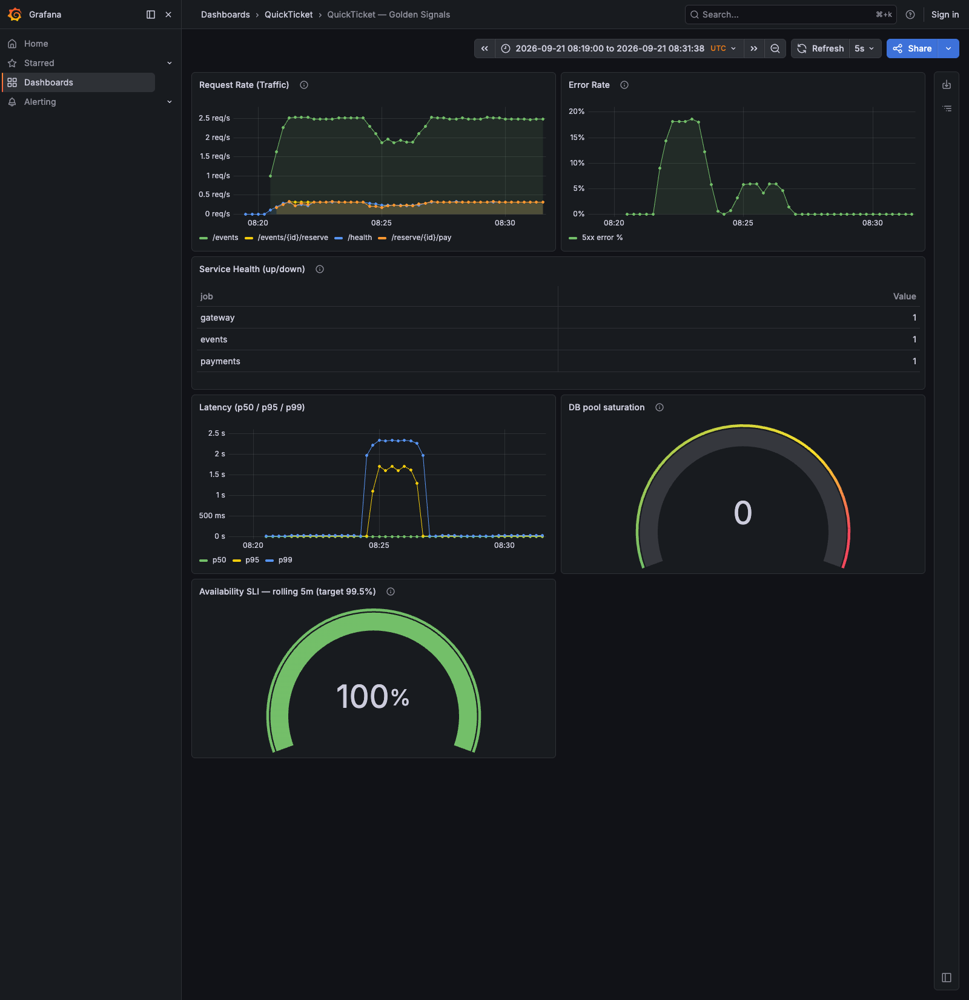
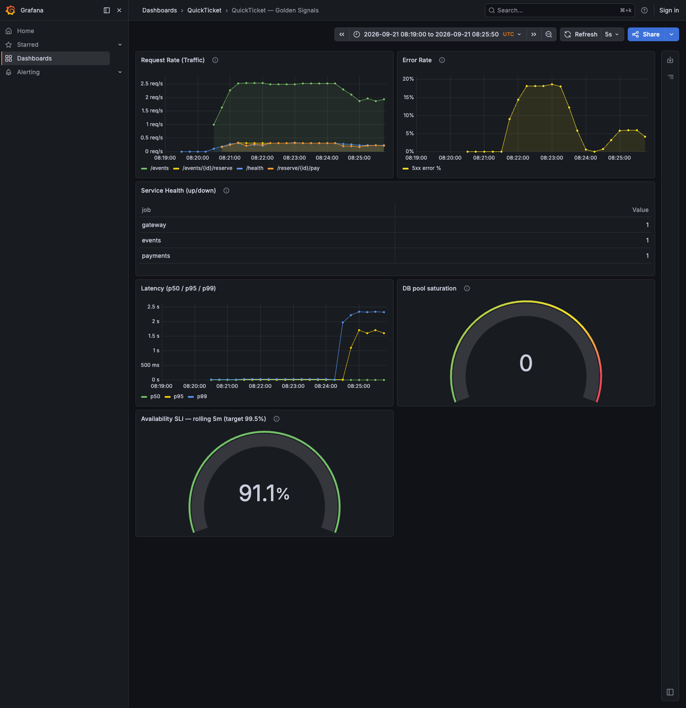

# Лабораторная 3 — Monitoring, Observability & SLOs

Выполнены Task 1, Task 2 и бонус корреляции логов/метрик. Проверено 21 сентября
2026 года, времена ниже — UTC. Стенд: Docker Desktop, Prometheus 3.11.2,
Grafana 13.0.1, приложение из `main` (cf2ad63), отдельный Compose-проект `sre-lab3`.

Конфигурация: [prometheus.yml](../monitoring/prometheus/prometheus.yml),
[recording rules](../monitoring/prometheus/rules.yml),
[дашборд](../monitoring/grafana/dashboards/golden-signals.json).
[Инструкция воспроизведения](../monitoring/prometheus/README.md),
[сценарий эксперимента](../scripts/lab3-observe.py),
[исходные измерения JSONL](evidence/lab3/observations.jsonl).

## Task 1 — Мониторинг и golden signals

### Запуск всех семи служб

```bash
docker compose -p sre-lab3 -f app/docker-compose.yaml -f docker-compose.monitoring.yaml up -d --build
docker compose -p sre-lab3 -f app/docker-compose.yaml -f docker-compose.monitoring.yaml ps
```

Вывод после восстановления отказов:

```text
NAME                    IMAGE                     COMMAND                  SERVICE      CREATED          STATUS                    PORTS
sre-lab3-events-1       sre-lab3-events           "uvicorn main:app --…"   events       10 minutes ago   Up 10 minutes             0.0.0.0:8081->8081/tcp, [::]:8081->8081/tcp
sre-lab3-gateway-1      sre-lab3-gateway          "uvicorn main:app --…"   gateway      10 minutes ago   Up 10 minutes             0.0.0.0:3080->8080/tcp, [::]:3080->8080/tcp
sre-lab3-grafana-1      grafana/grafana:13.0.1    "/run.sh"                grafana      10 minutes ago   Up 10 minutes             0.0.0.0:3000->3000/tcp, [::]:3000->3000/tcp
sre-lab3-payments-1     sre-lab3-payments         "uvicorn main:app --…"   payments     3 minutes ago    Up 3 minutes              0.0.0.0:8082->8082/tcp, [::]:8082->8082/tcp
sre-lab3-postgres-1     postgres:17-alpine        "docker-entrypoint.s…"   postgres     10 minutes ago   Up 10 minutes (healthy)   0.0.0.0:5432->5432/tcp, [::]:5432->5432/tcp
sre-lab3-prometheus-1   prom/prometheus:v3.11.2   "/bin/prometheus --c…"   prometheus   10 minutes ago   Up 10 minutes             0.0.0.0:9090->9090/tcp, [::]:9090->9090/tcp
sre-lab3-redis-1        redis:7-alpine            "docker-entrypoint.s…"   redis        10 minutes ago   Up 10 minutes (healthy)   0.0.0.0:6379->6379/tcp, [::]:6379->6379/tcp
```

### Scrape targets

```bash
curl -s http://localhost:9090/api/v1/targets | python3 -c '
import sys, json
for t in json.load(sys.stdin)["data"]["activeTargets"]:
    print(t["labels"]["job"], t["health"], t["scrapeUrl"])
'
```

```text
events       up       http://events:8081/metrics
gateway      up       http://gateway:8080/metrics
payments     up       http://payments:8082/metrics
```

Интервал scrape и evaluation — 15 секунд; группа SLO rules вычисляется каждые 30 секунд.
Использованы внутренние порты контейнеров 8080/8081/8082, а не опубликованный 3080.

### Метрики и нагрузка

```bash
curl -s http://localhost:9090/api/v1/label/__name__/values | python3 -c '
import sys, json
for n in json.load(sys.stdin)["data"]:
    if n.startswith(("gateway_", "events_", "payments_")): print(n)
'
```

```text
events_db_pool_size
events_orders_created
events_orders_total
events_request_duration_seconds_bucket
events_request_duration_seconds_count
events_request_duration_seconds_created
events_request_duration_seconds_sum
events_requests_created
events_requests_total
events_reservations_active
gateway_request_duration_seconds_bucket
gateway_request_duration_seconds_count
gateway_request_duration_seconds_created
gateway_request_duration_seconds_sum
gateway_requests_created
gateway_requests_total
payments_charges_created
payments_charges_total
payments_request_duration_seconds_bucket
payments_request_duration_seconds_count
payments_request_duration_seconds_created
payments_request_duration_seconds_sum
payments_requests_created
payments_requests_total
```

Нагрузка создавалась `python3 scripts/lab3-observe.py`: циклически восемь `/events`,
один `/health` и один полный checkout, пауза 0,3 с между итерациями.
Checkout использует событие 3 с большим запасом билетов. Фактическая интенсивность
зависит от задержек ответов; это не генератор с фиксированным RPS.

```bash
curl -s --data-urlencode 'query=sum(rate(gateway_requests_total[5m]))' \
  http://localhost:9090/api/v1/query
```

Значение из `data.result[0].value[1]`, форматированное до двух знаков:

```text
Request rate: 2.19 req/s
```

### Завершенные панели

Latency — Time series, единицы **seconds**, три агрегированные по `le` гистограммы:

```promql
histogram_quantile(0.50, sum by (le) (rate(gateway_request_duration_seconds_bucket[1m])))
histogram_quantile(0.95, sum by (le) (rate(gateway_request_duration_seconds_bucket[1m])))
histogram_quantile(0.99, sum by (le) (rate(gateway_request_duration_seconds_bucket[1m])))
```

Saturation — Gauge: `events_db_pool_size`, min 0, max 10; зеленый <7,
желтый ≥7, красный ≥9. Это число занятых соединений в момент scrape, а не число
запросов, ожидающих соединение. В эксперименте образцы были нулевыми: короткие
операции БД могли завершаться между scrape, поэтому это не доказательство отсутствия
любых мгновенных всплесков насыщения.

Error Rate дополнен fallback для отсутствующей серии 5xx: при здоровом трафике
отображается 0%, а не пустая панель. При полном отсутствии трафика ratio остается
неопределенным, а не искусственно здоровым.

Grafana API подтвердил загрузку всех шести панелей:

```text
1 timeseries   Request Rate (Traffic)
2 timeseries   Error Rate
3 table        Service Health (up/down)
4 timeseries   Latency (p50 / p95 / p99)
5 gauge        DB pool saturation
6 gauge        Availability SLI — rolling 5m (target 99.5%)
```

Дашборд также открыт и проверен в браузере:



### Остановка payments

```bash
python3 scripts/lab3-observe.py > /tmp/lab3-observations.jsonl
# Внутри сценария после 60 с baseline:
docker compose -p sre-lab3 -f app/docker-compose.yaml -f docker-compose.monitoring.yaml stop payments
# Через 120 с:
docker compose -p sre-lab3 -f app/docker-compose.yaml -f docker-compose.monitoring.yaml start payments
```

Значения запросов, используемых панелями, записывались каждые 5 секунд:

| Состояние | UTC | RPS (1m) | 5xx (1m) | p95 (1m) | Availability (5m) | Burn rate |
|---|---|---:|---:|---:|---:|---:|
| До отказа | 08:21:02.189 | 3.1851 | 0.0000% | 0.0097 с | 100.00% | 0.0000 |
| Payments остановлен | 08:23:03.175 | 3.4667 | 18.5897% | 0.0177 с | 90.18% | 19.6378 |
| 50% ошибок + 1000ms | 08:26:04.691 | 2.5999 | 5.9829% | 1.7023 с | 91.14% | 17.7135 |
| После восстановления | 08:31:37.697 | 3.4445 | 0.0000% | 0.0121 с | 100.00% | 0.0000 |

**Какой сигнал показал отказ первым?** Первым однозначным golden signal были **ошибки**:
остановка завершилась в **08:21:07.246**, первый `/health` 503 пришел в
**08:21:09.421** (+2,18 с), первый checkout 502 — в **08:21:09.755**.
На Prometheus Error Rate первый ненулевой образец появился в **08:21:37.427**
(+30,18 с). Измерение опрашивалось каждые 5 с, так что это время первой зафиксированной
точки, а не точное время перерисовки Grafana. Новым сериям 5xx нужны минимум два
scrape для `rate()`. Обновление Grafana — еще до 5 секунд.

Отдельный сигнал **scrape health** `up{job="payments"}` стал 0 раньше — в
**08:21:22.308** (+15,06 с); он не относится к четырем golden signals.
Latency не взлетела при остановке: соединение отклонялось быстро. Чтение событий
продолжало работать, поэтому только RPS не показывал тяжесть отказа checkout.

## Task 2 — SLI, SLO, budget и recording rules

- Availability SLI: доля инструментированных запросов gateway с ответом **не 5xx**;
  SLO **99,5% за 7 дней**.
- Latency SLI: доля запросов gateway, завершенных **не более чем за 500 мс**;
  SLO **95% за 7 дней**. Bucket `le="0.5"` включает границу 500 мс.
- `/health` входит в обе метрики, `/metrics` исключен middleware. 4xx считаются
  доступными согласно условию задания; быстрые ошибки входят и в latency SLI.

При 1000 запросов/день: **7000 × (1 − 0,995) = 35 допустимых 5xx/неделю**.
Для latency: **7000 × 0,05 = 350 запросов выше 500 мс/неделю**.
50,4 минуты/неделю — только эквивалент при равномерной нагрузке; фактический budget
считается по запросам.

Созданы три recording rules:

```bash
curl -s http://localhost:9090/api/v1/rules
```

Выдержка имен и состояния из API:

```text
gateway:sli_availability:ratio_rate5m              ok
gateway:sli_latency_500ms:ratio_rate5m             ok
gateway:error_budget_burn_rate:ratio_rate5m        ok
```

Правила подключены через `rule_files` и отдельный read-only mount в Compose.
Проверка реальным `promtool`:

```text
Checking /etc/prometheus/prometheus.yml
  SUCCESS: 1 rule files found
 SUCCESS: /etc/prometheus/prometheus.yml is valid prometheus config file syntax

Checking /etc/prometheus/rules.yml
  SUCCESS: 3 rules found
```

Дополнительные тесты покрывают отсутствие серии 5xx при здоровом трафике,
10% ошибок (burn rate 20), 20% медленных запросов, нулевой трафик и отсутствие метрик:

```bash
docker run --rm --entrypoint promtool \
  -v "$PWD/monitoring/prometheus:/rules:ro" -w /rules \
  prom/prometheus:v3.11.2 test rules rules.test.yml
```
```text
  SUCCESS
```

Gauge использует `gateway:sli_availability:ratio_rate5m * 100`, min 99,
max 100, красный ниже 99,5, зеленый начиная с 99,5.
После остановки payments SLI упал с 100% до примерно 90%, burn rate вырос выше 19.
Число остается видно даже ниже нижнего предела шкалы. После возврата payments
пятиминутное окно еще содержит ошибки, поэтому gauge восстанавливается с задержкой.
Последний образец эксперимента подтверждает availability **100%**, burn rate **0**.

Состояние дашборда во время инъекции ошибок:



Это короткое operational-окно, **не доказательство выполнения SLO за 7 дней**.
Для недельного отчета нужны `increase(...[7d])` и полная история; соответствующие
запросы приведены в README. Усреднять пятиминутные ratio для недельного SLI нельзя
без учета разного объема запросов.

## Бонус — Корреляция метрик и логов

Для изменения env контейнер payments пересоздан, а не просто перезапущен:

```bash
PAYMENT_FAILURE_RATE=0.5 PAYMENT_LATENCY_MS=1000 \
  docker compose -p sre-lab3 -f app/docker-compose.yaml -f docker-compose.monitoring.yaml \
  up -d --no-deps --force-recreate payments
```

| UTC | Событие |
|---|---|
| 08:24:07.443 | Начато пересоздание payments с fault injection |
| 08:24:08.062 | Контейнер пересоздан |
| 08:24:08.605 | payments: начало искусственной задержки для reservation `afd8b6df-44ce-455c-881c-66c4d9adb060` |
| 08:24:09.606 | payments: первый injected failure этого checkout |
| 08:24:09.608 | gateway: тот же reservation возвращает HTTP 500 |
| 08:24:23.865 | В панели Error Rate снова ненулевой образец (0,7246%) после предыдущего восстановления |
| 08:24:38.985 | p95 превысил 500 мс: 1,0964 с |
| 08:26:08.685 | Восстановлены PAYMENT_FAILURE_RATE=0.0, PAYMENT_LATENCY_MS=0 |
| 08:26:10.342 | Первый успешный checkout после восстановления |
| 08:31:37.697 | Пятиминутный availability SLI вернулся к 100%, burn rate к 0 |

Во время второго отказа `up{job="payments"}=1`: успешный scrape не означает, что
платежи проходят. На границе пересоздания был также краткий `/health` 503; его
не следует путать с последующими намеренными HTTP 500 от payments.

```bash
docker compose -p sre-lab3 -f app/docker-compose.yaml -f docker-compose.monitoring.yaml \
  logs --timestamps --since 2m gateway payments
```

Логи сохранены до следующего пересоздания контейнера. Коррелирующий фрагмент:

```text
gateway-1   | 2026-09-21T08:21:09.752869719Z INFO:     192.168.65.1:38921 - "POST /reserve/84869f24-f4c9-4436-aeb1-e37e55993d45/pay HTTP/1.1" 502 Bad Gateway
gateway-1   | 2026-09-21T08:21:09.752867969Z {"time":"2026-09-21 08:21:09,751","level":"ERROR","service":"gateway","msg":"payment error: [Errno -2] Name or service not known"}
payments-1  | 2026-09-21T08:24:08.605763594Z {"time":"2026-09-21 08:24:08,605","level":"INFO","service":"payments","msg":"Injecting 1000ms latency for afd8b6df-44ce-455c-881c-66c4d9adb060"}
payments-1  | 2026-09-21T08:24:09.606726511Z {"time":"2026-09-21 08:24:09,606","level":"WARNING","service":"payments","msg":"Payment failed (injected) for afd8b6df-44ce-455c-881c-66c4d9adb060"}
gateway-1   | 2026-09-21T08:24:09.608155469Z INFO:     192.168.65.1:60962 - "POST /reserve/afd8b6df-44ce-455c-881c-66c4d9adb060/pay HTTP/1.1" 500 Internal Server Error
```

**Root cause:** `PAYMENT_LATENCY_MS=1000` заставляет обработчик `/charge` ждать
одну секунду; `PAYMENT_FAILURE_RATE=0.5` случайно возвращает HTTP 500.
Gateway передает ошибку клиенту, что видно по одному reservation ID и соседним
временным меткам в обеих службах. Это отказ платежей, а не БД: чтение событий
продолжалось, payments оставался доступен для scrape, latency checkout выросла.
Глобальная доля ошибок меньше 50%, потому что checkout — только часть трафика;
сама выборка случайна. p95/p99 оцениваются интерполяцией bucket: при фактической
задержке около 1 с оценка p99 доходила до примерно 2,34 с из-за широкого bucket 1–2,5 с.

После эксперимента восстановлены штатные env payments, все три targets `up`,
все rules `ok`. Результаты основаны на реальном запуске, а не на ожидаемом выводе.
